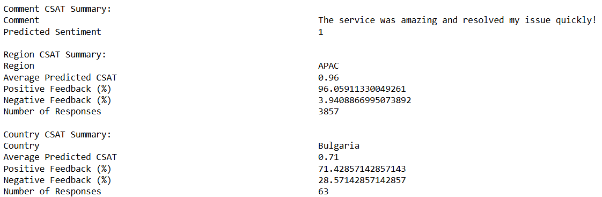

# <div align="center"> Optimizing CSAT Through Sentiment Analysis and Predictive Modeling Techniques</div>

<div align="center"></div>

## Overview

Customer Satisfaction (CSAT) is a crucial indicator of service quality in organizations. However, understanding the factors that contribute to customer dissatisfaction and predicting negative experiences remains a challenge. This project applies two advanced techniques to address this issue:

**1. Sentiment Analysis – Analyzing customer feedback to determine whether comments are positive or negative.**
   
**2. Predictive Modeling – Using machine learning to classify customer satisfaction levels based on incident-related data.**
   
By combining natural language processing (NLP) and machine learning, this project aims to provide deeper insights into customer feedback and proactively anticipate dissatisfaction. The goal is to enhance organizational response strategies and improve overall service efficiency.

## Objectives

This study is structured around three key objectives. Below are the objective and the key findings:

### Objective 1: Sentiment Analysis for Customer Feedback

- AFINN initially showed the best classification accuracy.
  
- However, as shown below, it fails to capture the actual sentiment of customer feedback correctly.


  
- Due to AFINN’s limitations, we explored a more advanced BERT model, which significantly improved sentiment detection.


```python
# Fine-Tune to my dataset, so BERT can learn the "lenggok" of user's comment.

from transformers import BertTokenizer, BertForSequenceClassification, Trainer, TrainingArguments
from torch.utils.data import Dataset
import torch

# Load tokenizer and model
tokenizer = BertTokenizer.from_pretrained("nlptown/bert-base-multilingual-uncased-sentiment")
model = BertForSequenceClassification.from_pretrained("nlptown/bert-base-multilingual-uncased-sentiment", num_labels=2, ignore_mismatched_sizes=True)

# Custom Dataset Class
class CustomDataset(Dataset):
    def __init__(self, encodings):
        self.encodings = encodings

    def __len__(self):
        return len(self.encodings["input_ids"])

    def __getitem__(self, idx):
        return {key: tensor[idx] for key, tensor in self.encodings.items()}

# Encode the data
def encode_data(texts, labels, tokenizer, max_length=128):
    encodings = tokenizer(list(texts), truncation=True, padding=True, max_length=max_length, return_tensors="pt")
    encodings['labels'] = torch.tensor(list(labels))
    return encodings

train_encodings = encode_data(train_texts, train_labels, tokenizer)
val_encodings = encode_data(val_texts, val_labels, tokenizer)

train_dataset = CustomDataset(train_encodings)
val_dataset = CustomDataset(val_encodings)

# Training arguments
training_args = TrainingArguments(
    output_dir="./results",
    evaluation_strategy="epoch",
    save_strategy="epoch",
    per_device_train_batch_size=16,
    num_train_epochs=2,
    weight_decay=0.01,
    fp16=True,
)

# Trainer with metrics
def compute_metrics(pred):
    from sklearn.metrics import accuracy_score, precision_recall_fscore_support
    labels = pred.label_ids
    preds = pred.predictions.argmax(-1)
    precision, recall, f1, _ = precision_recall_fscore_support(labels, preds, average='binary')
    acc = accuracy_score(labels, preds)
    return {"accuracy": acc, "f1": f1, "precision": precision, "recall": recall}

# Trainer
trainer = Trainer(
    model=model,
    args=training_args,
    train_dataset=train_dataset,
    eval_dataset=val_dataset,
    compute_metrics=compute_metrics,
)

# Define the predict_sentiment function
def predict_sentiment(texts, model, tokenizer, batch_size=32):
    model.eval()  # Set the model to evaluation mode
    predictions = []
    with torch.no_grad():
        for i in range(0, len(texts), batch_size):
            batch_texts = texts[i:i + batch_size]
            inputs = tokenizer(list(batch_texts), return_tensors="pt", truncation=True, padding=True, max_length=128)
            outputs = model(**inputs)
            probs = torch.softmax(outputs.logits, dim=1)
            preds = torch.argmax(probs, axis=1).tolist()
            predictions.extend(preds)
    return predictions

# Train the model
trainer.train()

from sklearn.metrics import classification_report
predictions = predict_sentiment(val_texts, model, tokenizer)
print(classification_report(val_labels, predictions))

# Save the trained model
model.save_pretrained("bert_sentiment_model_v3")
tokenizer.save_pretrained("bert_sentiment_model_v3")
```

### Objective 2: Aligning Sentiment with CSAT Scores


- The model detected 5.75% of user-labeled Negative feedback as actually Positive, improving sentiment alignment.

- It also detected 0.65% of user-labeled Positive feedback as actually Negative, uncovering hidden dissatisfaction.

- This alignment improves the reliability of CSAT scores.

### Objective 3: Predictive Modeling of CSAT Using ML

- The following machine learning models were applied:

  - Logistic Regression (Baseline Model)
  - Random Forest
  - Support Vector Machine (SVM)
  - Gradient Boosting Machine (GBM)

- Evaluation Metrics:

- Accuracy – Overall correctness of predictions.
- ROC-AUC Score – Ability to distinguish sentiment polarity.
- Precision, Recall, F1-score – Balance between false positives & false negatives.
- Confusion Matrix – Insights into correct vs. misclassified instances.
```python
# Import necessary libraries
import pandas as pd
import matplotlib.pyplot as plt
from sklearn.model_selection import train_test_split
from sklearn.ensemble import RandomForestClassifier, GradientBoostingClassifier
from sklearn.svm import SVC
from sklearn.metrics import classification_report, roc_auc_score, confusion_matrix
from sklearn.linear_model import LogisticRegression

# Perform One-Hot Encoding for both Country and Region
df = df.loc[:, ~df.columns.str.startswith("Region_")]  
df = df.loc[:, ~df.columns.str.startswith("Country_")]  

# Apply one-hot encoding
region_encoded = pd.get_dummies(df['Region'], prefix='Region', dtype=int)
country_encoded = pd.get_dummies(df['Country'], prefix='Country', dtype=int)

# Concatenate the new encoded features with the original dataframe
df = pd.concat([df, region_encoded, country_encoded], axis=1)

# Remove duplicate columns if any
df = df.loc[:, ~df.columns.duplicated()]

# Prepare feature set and target (without Country_Freq)
X = df[list(region_encoded.columns) + list(country_encoded.columns) + ['Predicted_Sentiment']]
y = df['Sentiment'].map({"Positive": 1, "Negative": 0})  # Binary target mapping

# Train-Test Split
X_train, X_test, y_train, y_test = train_test_split(X, y, test_size=0.2, random_state=42)

# Initialize models (Adding Logistic Regression)
models = {
    "Random Forest": RandomForestClassifier(random_state=42),
    "SVM": SVC(probability=True, random_state=42),  # Enable probability for ROC-AUC
    "Gradient Boosting": GradientBoostingClassifier(random_state=42),
    "Logistic Regression": LogisticRegression(random_state=42, max_iter=1000)  # Ensure convergence
}

# Train, Predict, and Evaluate
results = {}
for name, model in models.items():
    print(f"Training {name}...")
    
    model.fit(X_train, y_train)
    
    # Predict on original test set
    predictions = model.predict(X_test)
    probabilities = model.predict_proba(X_test)[:, 1] if hasattr(model, "predict_proba") else None
    
    # Evaluate
    accuracy = (predictions == y_test).mean()
    roc_auc = roc_auc_score(y_test, probabilities) if probabilities is not None else "N/A"
    classification_rep = classification_report(y_test, predictions, digits=4)
    confusion_mat = confusion_matrix(y_test, predictions)
    
    # Store results
    results[name] = {
        "Accuracy": round(accuracy, 4),
        "ROC-AUC": round(roc_auc, 4) if roc_auc != "N/A" else "N/A",
        "Classification Report": classification_rep,
        "Confusion Matrix": confusion_mat
    }

# Display Results
for model_name, metrics in results.items():
    print(f"Model: {model_name}")
    print(f"Accuracy: {metrics['Accuracy']}")
    print(f"ROC-AUC: {metrics['ROC-AUC']}")
    print("Classification Report:")
    print(metrics["Classification Report"])
    print("Confusion Matrix:")
    print(metrics["Confusion Matrix"])
    print("\n" + "-"*50 + "\n")
```

**Key Finding:**


- Logistic Regression achieved the highest ROC-AUC (0.9512), demonstrating its superior ability to distinguish sentiment polarity, despite high accuracy across all models (97.62%).

## 📈 Output for Objective 3



##  Conclusion

✅ BERT significantly outperforms lexicon-based methods in understanding context, negations, and nuanced sentiment.

✅ Machine learning models achieved high accuracy (97.62%), proving their effectiveness in predicting customer satisfaction.

✅ Logistic Regression outperformed other models in ROC-AUC, making it the most effective model for sentiment classification.


## Future Enhancements

- Expand to Multilingual Feedback – Incorporate customer reviews in different languages to improve global applicability.

- Feature Expansion – Add Ticket Priority, User Type, and additional metadata for better prediction accuracy.

- Explore Advanced Transformers – Investigate more sophisticated NLP models for improved sentiment classification.


