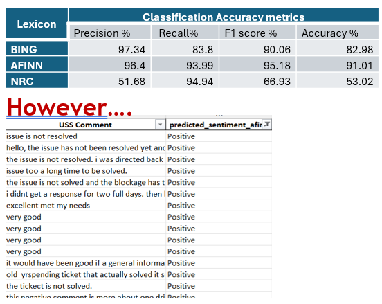
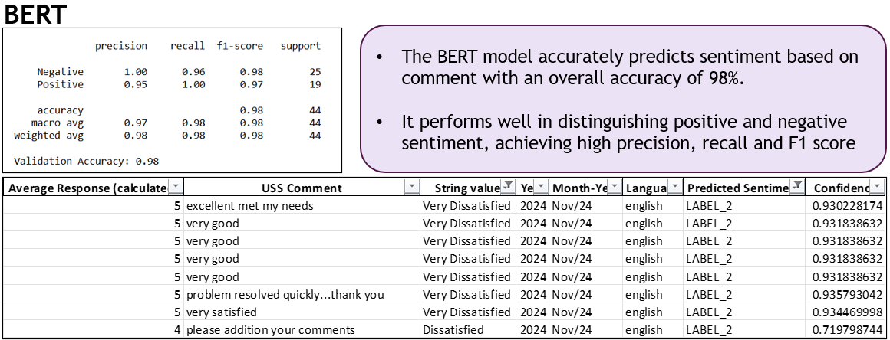
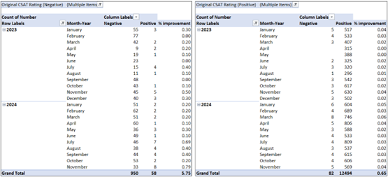
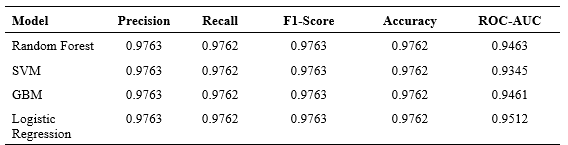

# 
 Optimizing CSAT Through Sentiment Analysis and Predictive ML Techniques

## Project Overview

Customer Satisfaction (CSAT) is a crucial indicator of service quality in organizations. However, understanding the factors that contribute to customer dissatisfaction and predicting negative experiences remains a challenge. This project applies two advanced techniques to address this issue:

**Sentiment Analysis – Analyzing customer feedback to determine whether comments are positive or negative.**
   
**Predictive Modeling – Using machine learning to classify customer satisfaction levels based on incident-related data.**
   
By combining natural language processing (NLP) and machine learning, this study aims to provide deeper insights into customer feedback and proactively anticipate dissatisfaction. The goal is to enhance organizational response strategies and improve overall service efficiency.

## Research Objectives

This study is structured around three key research objectives. Below are the objective and the key findings:

### Objective 1: Sentiment Analysis for Customer Feedback

- AFINN initially showed the best classification accuracy.
  
- However, as shown below, it fails to capture the actual sentiment of customer feedback correctly.

  
- Due to AFINN’s limitations, we explored a more advanced BERT model, which significantly improved sentiment detection.

  
### Objective 2: Aligning Sentiment with CSAT Scores

- The model detected 5.75% of user-labeled Negative feedback as actually Positive, improving sentiment alignment.

- It also detected 0.65% of user-labeled Positive feedback as actually Negative, uncovering hidden dissatisfaction.

- This alignment improves the reliability of CSAT scores.

### Objective 3: Predictive Modeling of CSAT Using ML

- The following machine learning models were applied:

  - Logistic Regression (Baseline Model)
  - Random Forest
  - Support Vector Machine (SVM)
  - Gradient Boosting Machine (GBM)

- Evaluation Metrics:

- Accuracy – Overall correctness of predictions.
- ROC-AUC Score – Ability to distinguish sentiment polarity.
- Precision, Recall, F1-score – Balance between false positives & false negatives.
- Confusion Matrix – Insights into correct vs. misclassified instances.

**Key Finding:**

- Logistic Regression achieved the highest ROC-AUC (0.9512), demonstrating its superior ability to distinguish sentiment polarity, despite high accuracy across all models (97.62%).

## 📈 Conclusion

✅ BERT significantly outperforms lexicon-based methods in understanding context, negations, and nuanced sentiment.

✅ Machine learning models achieved high accuracy (97.62%), proving their effectiveness in predicting customer satisfaction.

✅ Logistic Regression outperformed other models in ROC-AUC, making it the most effective model for sentiment classification.

## Future Enhancements

- Expand to Multilingual Feedback – Incorporate customer reviews in different languages to improve global applicability.

- Feature Expansion – Add Ticket Priority, User Type, and additional metadata for better prediction accuracy.

- Explore Advanced Transformers – Investigate more sophisticated NLP models for improved sentiment classification.

## Repository Structure

📂 Optimizing-CSAT-Sentiment-Analysis
│── 📂 images                 # Contains all visualization images
│── 📂 data                   # Dataset used for analysis
│── 📂 notebooks              # Jupyter notebooks for analysis and modeling
│── README.md                # Project documentation
│── requirements.txt         # Dependencies for model execution

